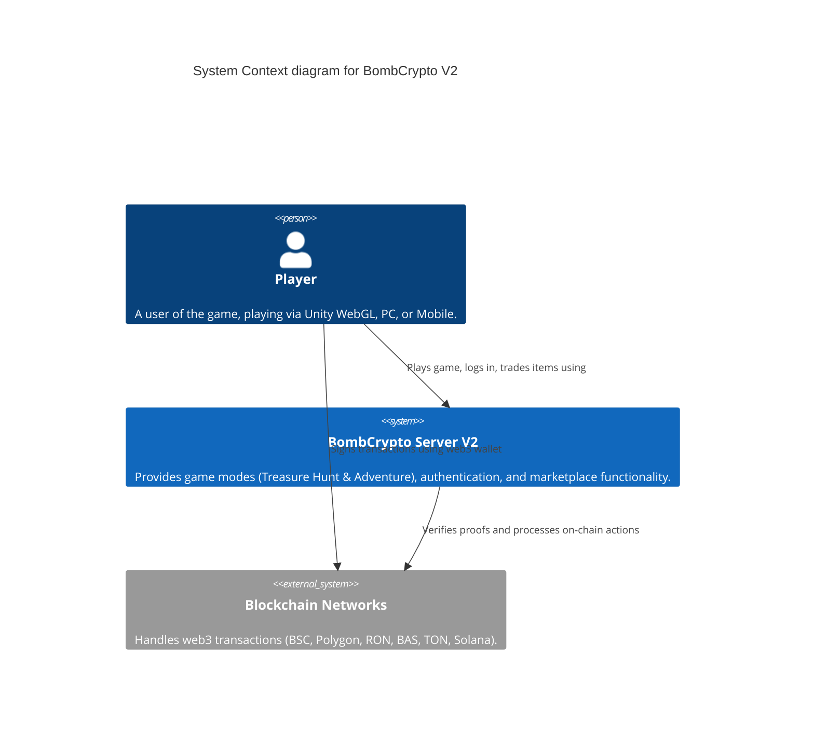
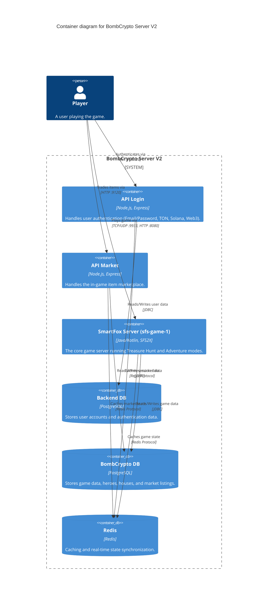

# System Context & Container Diagrams

This document uses the [C4 Model](https://c4model.com/) to illustrate the architecture of the BombCrypto Server V2 system.

## Level 1: System Context Diagram

This diagram shows the high-level interactions between the users, the BombCrypto system, and external services.

## Level 2: Container Diagram

This diagram dives deeper into the `BombCrypto Server V2` system, showing its microservices and data stores.

