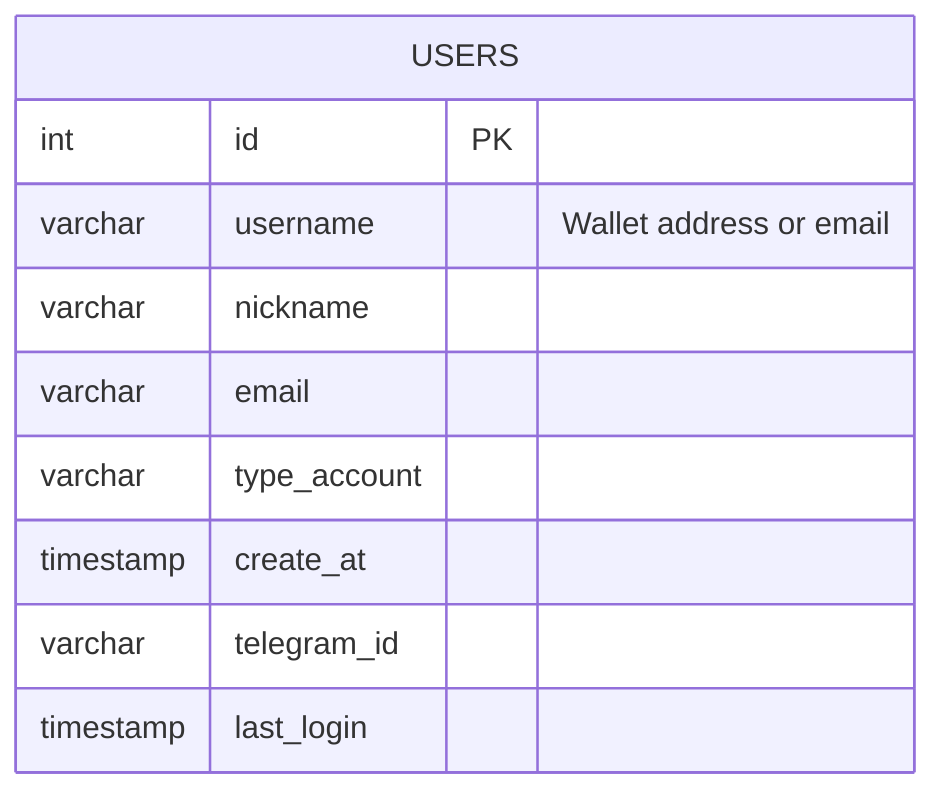
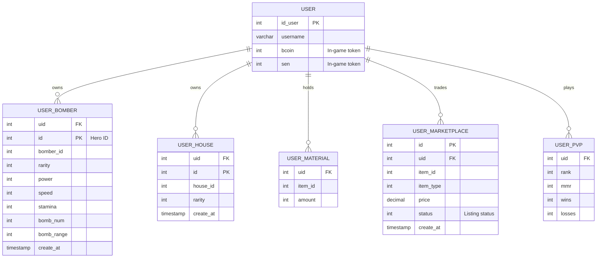

# Database Schema Diagrams

This document outlines the core entity-relationship (ER) diagrams for the BombCrypto Server V2 databases, `backend` (used by ap-login) and `bombcrypto` (used by the game server and marketplace).

## 1. Backend Database (`backend`)

This database handles user registration and authentication.

## 2. BombCrypto Database (`bombcrypto`)

This database contains the core game logic, user assets (heroes, houses), and marketplace data. Due to the large number of tables, this diagram highlights the most critical entities and their relationships.

