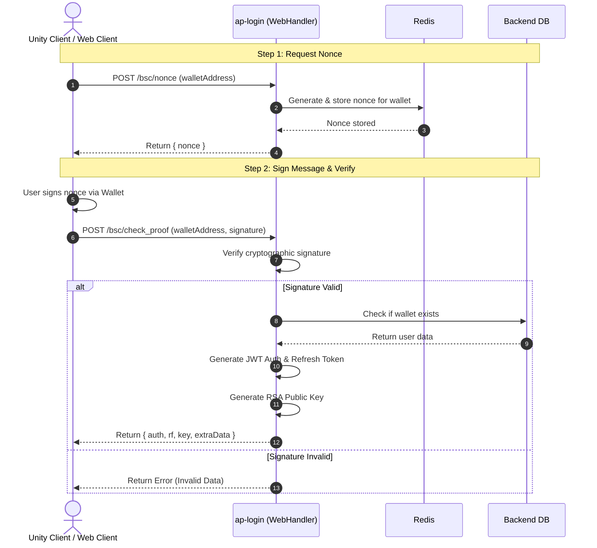
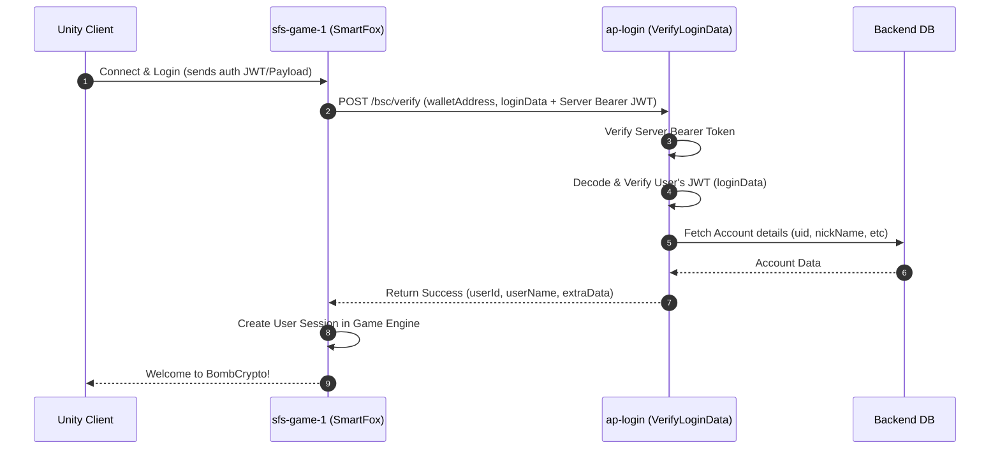

# Sequence Diagrams

This document outlines the core operational flows for the BombCrypto Server V2 system.

## 1. Web3 Wallet Login Flow (ap-login)

The following sequence diagram maps out the REST endpoints involved when a player logs into the system using a Web3 wallet (via `WebRouter.ts`).

## 2. Server-to-Server Authentication Flow

When the game server (SmartFox) or marketplace needs to verify a user's action, it communicates with the `ap-login` service.

